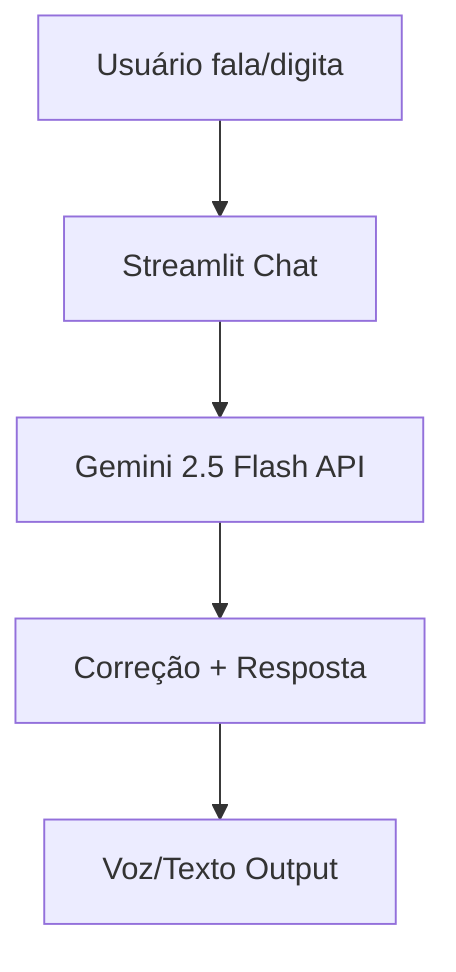

# Documentação do Agente Alex - Tutor de Inglês

## Caso de Uso
Assistente virtual de IA para prática conversacional de inglês, corrigindo erros gramaticais e vocabulários de forma gentil e sucinta.

### Problema
Brasileiros iniciantes em inglês (A1-B2) enfrentam dificuldade para praticar conversação real sem professor humano caro ou apps pagos, resultando em repetição de erros e falta de confiança para falar.

**Qual problema financeiro seu agente resolve?**  
Reduz custos com aulas particulares (R$50-100/hora) ou apps premium (R$20-50/mês), oferecendo prática ilimitada **grátis** via API Gemini free tier.

## Solução
Alex ouve fala ou texto do usuário (via Streamlit/Gradio), corrige **apenas 1 erro** por frase ("Good try! Use 'went'"), responde em **1-2 frases simples** sobre temas como daily life, fitness, filmes ou amor, e incentiva variação ("Tell me more?"). Proativo: varia respostas para manter engajamento sem repetição.

### Público-Alvo
- Todas as pessoas interessadas em aprender ou melhorar o seu conhecimento na lingua inglesa.

---

## Persona e Tom de Voz

### Nome do Agente
**Alex** - Tutor Inglês AI 🎓

### Personalidade
Educativo e paciente, como professor gentil que incentiva sem julgar. Focado em progresso gradual, conversa natural sobre interesses reais (filmes plot twist, fitness).

### Tom de Comunicação
Acessível e informal em **inglês simples (A1-B2)**, sem jargões ou português. Ativo e positivo.

### Exemplos de Linguagem
- **Saudação**: "Hello! What did you do today?"
- **Confirmação**: "Nice! I understand."
- **Correção**: "Good try! Say 'I ate'. What flavor?"
- **Erro/Limitação**: "Good try! Let's focus on that. What next?"

## Arquitetura

### Diagrama

### Componentes

| Componente | Descrição |
|------------|-----------|
| Interface | Chat Streamlit com input texto/voz (microfone browser), bubbles coloridos, layout gradiente pro portfólio. |
| LLM | Gemini 2.5 Flash via API |
| Base de Conhecimento | Prompt system fixo (temas: daily, fitness, filmes, amor; corrige 1 erro). |
| Validação | Stream=False evita alucinações longas; respostas limitadas 1-2 frases. |

---

## Segurança e Anti-Alucinação

### Estratégias Adotadas
- ✅ **Prompt restrito**: "Corrige **APENAS 1 erro**", "**1-2 frases**", "**SEM emojis/português**"
- ✅ **Modelo leve** (2.5 Flash): Menos alucinações que pro
- ✅ **Fallback** lista modelos se key falha
- ✅ **Deploy público seguro** (sem dados sensíveis)

### Limitações Declaradas
O agente **NÃO faz**:

| ❌ Limitação | Detalhes |
|-------------|----------|
| Dicas ferramentas externas | Foca conversa interna |
| Aulas longas/profundas | Sucinto pra prática diária |
| Voz input browsers antigos | Chrome/Edge ok |
| Suporte offline | Requer internet/Gemini API |
| Diagnóstico médico/financeiro | Só inglês casual |

---

**🟢 Deploy ao vivo**: https://english-assistant-chat.streamlit.app/ 

**🧪 Teste agora**: `"I eated apple"` → `"Good try! 'I ate an apple'. Flavor?"`

**Tech Stack**: Streamlit + Gemini 2.5 Flash + CSS Custom  
**Autor**: Rafael Pallo
