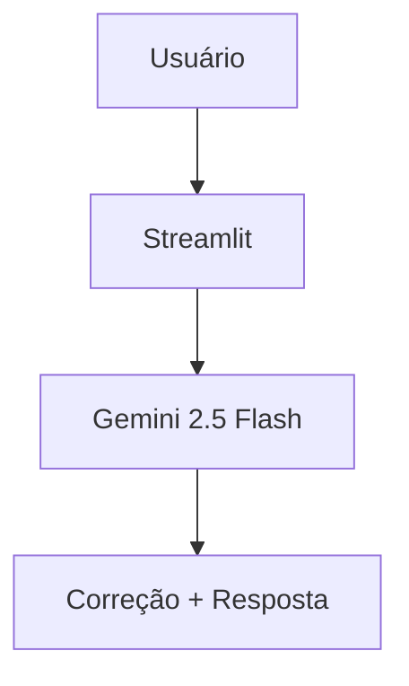

# 🎓 Alex - Tutor Inglês AI

## 🚀 **Sobre**
**Alex** corrige seu inglês **gentilmente** em tempo real! Fala sobre daily life, fitness, filmes ou amor.  
**Grátis** via Gemini API.

[](https://streamlit.io)
[](https://aistudio.google.com)

## ✨ **Funcionalidades**
- ✅ **Correção gentil**: "Good try! Use 'went'" (1 erro/frase)
- ✅ **Temas reais**: Gym, filmes, amor, daily
- ✅ **Sucinto**: 1-2 frases sempre
- ✅ **Responsive**: Desktop/mobile
- ✅ **Zero custo**: Gemini free tier

## 🖥️ **Demo**
**[Teste agora!]((https://english-assistant-chat.streamlit.app/))**  
*"I eated apple"* → *"Good try! 'I ate an apple'. Flavor?"*


## 📋 Como Usar
1. Digite/fale inglês
2. Alex corrige + conversa
3. Pratique mais! 🎯

## 🏗️ Arquitetura

## 🛠️ **Tech Stack**

| **Frontend** | **Backend** | **Deploy** |
|--------------|-------------|------------|
| Streamlit | Gemini API | Streamlit Cloud |

## 🚀 **Setup Local**
```bash
git clone https://github.com/RafaelPallo/english-assistant-chat/
cd english-assistant-chat

# API Key GRÁTIS: https://aistudio.google.com/app/apikey

# .streamlit/secrets.toml
GEMINI_API_KEY = sua_chave_aqui

pip install -r requirements.txt
streamlit run app.py

📁 Estrutura
text
├── app.py                 # App principal
├── requirements.txt       # Dependências
├── .streamlit/secrets.toml # API Key
├── docs/
│   └── 01-documentacao-agente.md
└── README.md
```
## 🛡️ **Limitações**
- ❌ **Sem offline** `(requer internet/Gemini API)`
- ❌ **Browsers antigos** `(IE não funciona)`
- ✅ **Chrome/Edge** `perfeito 100%`

## 🤝 **Contribuições**
1. **Fork** o repositório ⭐
2. Crie **branch**: `git checkout -b feature/nova-funcionalidade`
3. **Commit**: `git commit -m 'Add: nova funcionalidade'`
4. **Push**: `git push origin feature/nova-funcionalidade`
5. Abra **Pull Request** 🎉

## 📄 **Licença**
[](LICENSE)


👨‍💼 Autor
Rafael Pallo
